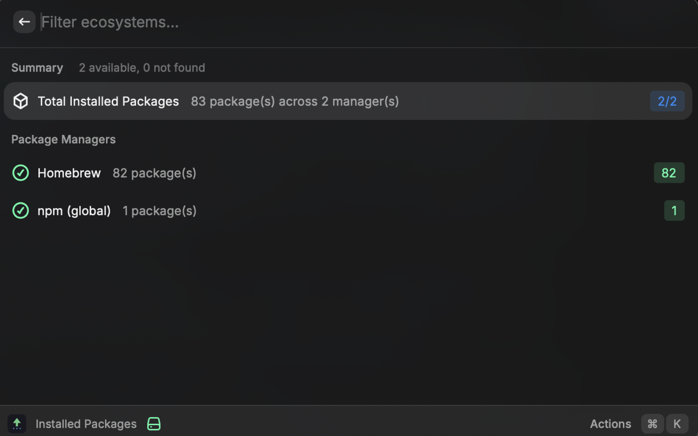
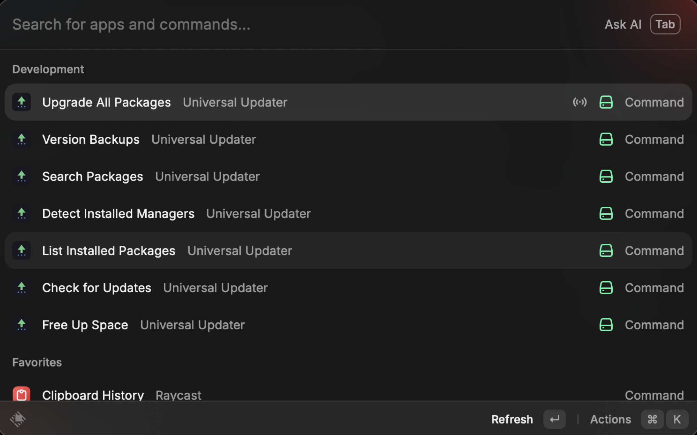
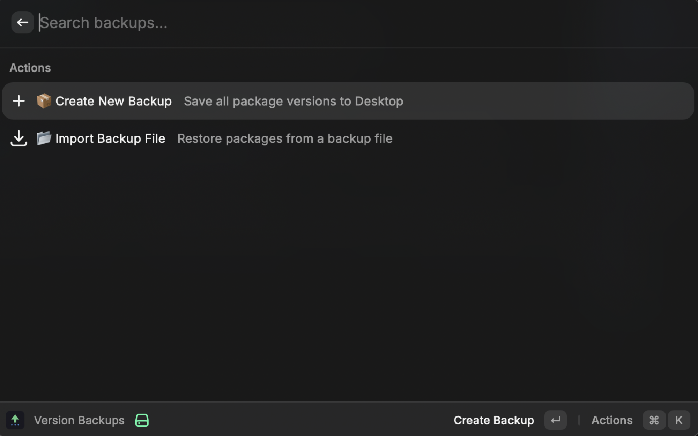
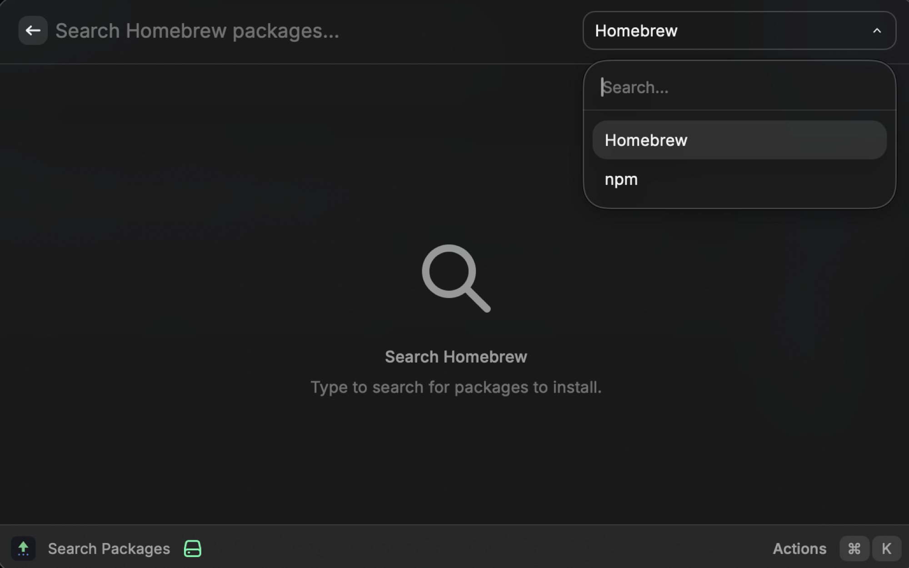
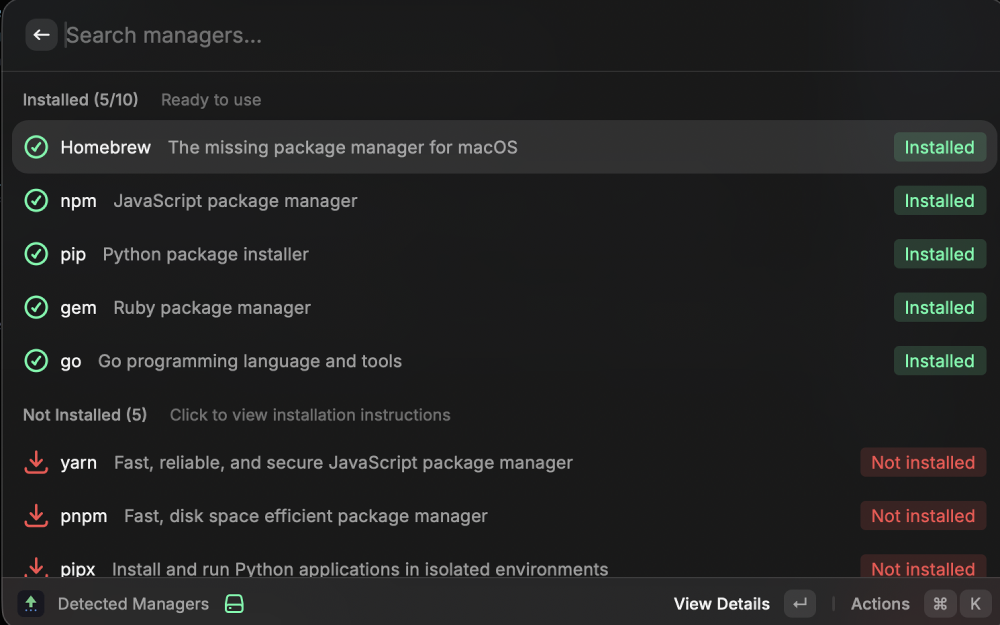
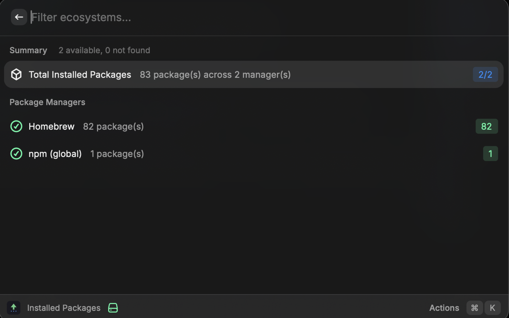
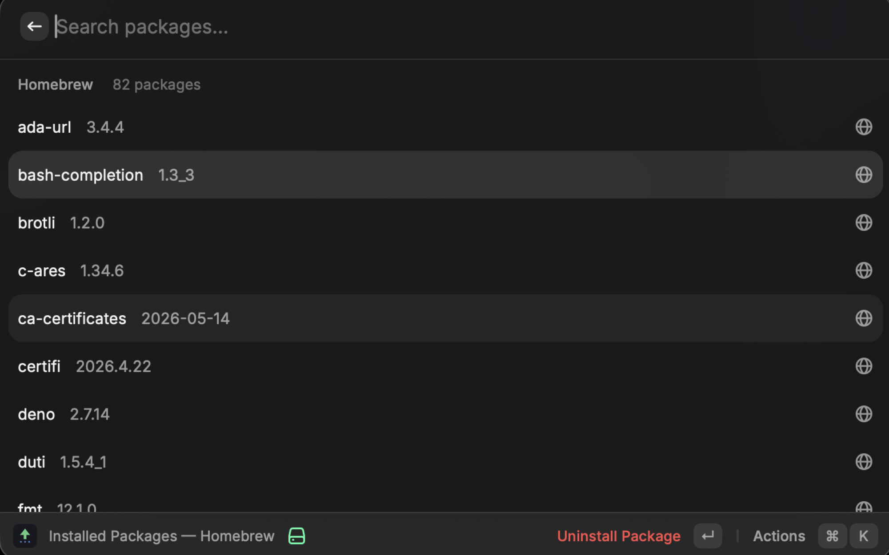

# Universal Updater

Universal Updater is a Raycast extension for checking, upgrading, auditing, and backing up packages across Homebrew, npm, Yarn, pnpm, pip, pipx, Cargo, RubyGems, Mac App Store apps, Bun, Deno, Composer, and Go tools from one place.

Maintained by BalajiTechLabs

GitHub: https://github.com/balajitechlabs

Portfolio: https://portfolio.balajitechlab.com

## Screenshots









## Highlights

- Check update status across multiple ecosystems in one view.
- Open package websites and changelog links before upgrading.
- Install a specific package from the ecosystem you choose.
- Export version backups to your Desktop for easy sharing or archiving.
- Import a backup file later to restore package versions on a fresh Mac or another machine.
- See which package managers are installed and get install guidance for the missing ones.
- Receive macOS notifications when updates are found, even when Raycast is running in the background.

## Commands

| Command                | Purpose                                                     |
| ---------------------- | ----------------------------------------------------------- |
| Check for Updates      | View outdated packages and upgrade safely.                  |
| Upgrade All            | Upgrade every enabled ecosystem in one run.                |
| List Installed Packages | Browse installed packages and versions.                    |
| Detect Managers        | See which CLIs are available and how to install missing ones. |
| Version Backups        | Create, open, and restore version snapshots.                |
| Search Packages        | Search and install new packages from registries.           |
| Free Up Space          | Run cleanup commands to reclaim disk space.                |
| System Health          | Run diagnostics to verify package manager health.          |
| Security Audit         | Scan installed packages for vulnerabilities.                |
| Ignored Packages       | Review packages hidden from update checks.                  |

## Version Backups

Backups are designed to be easy to move between devices. When you create one, the extension saves a JSON file on your Desktop and also keeps a local copy in the hidden backup folder. That makes the file simple to upload to cloud storage, send over Telegram, copy to an external drive, or restore after a Mac reset.

### Create a backup

1. Open Raycast and run `Version Backups`.
2. Choose `Create New Backup`.
3. The extension saves a backup file to your Desktop and shows a macOS notification.

### Restore a backup

1. Open `Version Backups`.
2. Choose `Import Backup File`.
3. Select the JSON backup file from Desktop, Downloads, iCloud Drive, USB storage, or any other folder.
4. The extension restores the package versions listed in that file.

### Backup contents

The backup contains package names and versions for enabled ecosystems only. It does not include personal files or other user data.

Example format:

```json
{
  "brew": {
    "git": "2.49.0",
    "node": "22.14.0"
  },
  "npm": {
    "typescript": "5.8.3"
  },
  "pip": {
    "requests": "2.32.3"
  }
}
```

## Safety

- The extension asks before upgrades when confirmation is enabled in preferences.
- Package managers are checked before use so missing tools fail cleanly.
- Backups are plain JSON files, so you can inspect them before restoring.
- The restore flow only reinstalls packages listed in the backup file.

## Installation

### Local development

```bash
npm install
npm run build
```

Then import the built extension folder into Raycast.

### Development mode

```bash
npm run dev
```

## Supported ecosystems

| Ecosystem     | Supported |
| ------------- | --------- |
| Homebrew      | Yes       |
| npm           | Yes       |
| Yarn          | Yes       |
| pnpm          | Yes       |
| pip           | Yes       |
| pipx          | Yes       |
| Cargo         | Yes       |
| RubyGems      | Yes       |
| Mac App Store | Yes       |
| Go tools      | Yes       |

## License

MIT License

Copyright (c) 2026 BalajiTechLabs

See [LICENSE](LICENSE) for the full text.

